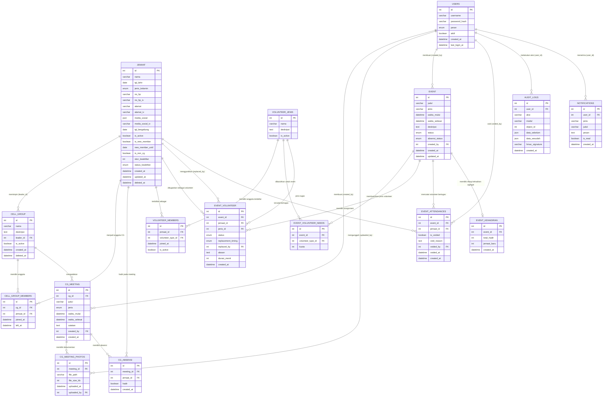

# ERD — GODS DNA CMS

Diagram ini merepresentasikan 16 tabel utama sesuai BAGIAN 0 dokumen
spesifikasi (ALUR SISTEM LENGKAP — GODS DNA CMS).

Tipe data pada diagram ini bersifat konseptual (int, varchar, text, date,
datetime, boolean, json, enum). Tipe data SQL final (panjang VARCHAR,
INT vs BIGINT, dsb) ditentukan di Step 6 — Database Schema.

## Daftar 16 Tabel Utama

| No | Tabel | Deskripsi Singkat |
|----|-------|-------------------|
| 1 | `users` | Akun login ADMIN/LEADER |
| 2 | `jemaat` | Data jemaat, termasuk field terenkripsi & skor keaktifan |
| 3 | `cell_group` | Master data Cell Group (CG) |
| 4 | `cell_group_members` | Relasi many-to-many jemaat ↔ CG |
| 5 | `cg_meeting` | Catatan meeting per CG |
| 6 | `cg_meeting_photos` | Foto dokumentasi meeting (maks 10, dikompres) |
| 7 | `cg_absensi` | Absensi per jemaat per meeting CG |
| 8 | `volunteer_jenis` | Master jenis volunteer (Multimedia, Usher, dll) |
| 9 | `volunteer_members` | Pendaftaran jemaat ke jenis volunteer |
| 10 | `event` | Data event + siklus status (DRAFT→...→DIARSIPKAN) |
| 11 | `event_volunteer_needs` | Kebutuhan jumlah volunteer per jenis per event |
| 12 | `event_volunteer` | Assignment volunteer ke event (termasuk penggantian) |
| 13 | `event_attendances` | Catatan volunteer yang bertugas di event |
| 14 | `event_kehadiran` | Rekap agregat kehadiran event (total_hadir, jemaat_baru) |
| 15 | `audit_logs` | Log audit append-only dengan HMAC |
| 16 | `notifications` | Notifikasi in-app untuk LEADER (LOGIN_GAGAL_BERULANG, dll) |

## Catatan Penamaan

- Seluruh nama tabel di atas diambil **persis** dari BAGIAN 0 dokumen
  (entitas #1–#15), termasuk konsistensi singular/plural per tabel
  (`cell_group`, `cg_meeting` = singular; `cell_group_members`,
  `event_volunteer_needs`, `audit_logs` = plural — sesuai apa adanya
  di dokumen).
- Relasi `EVENT ||--o| EVENT_KEHADIRAN` digambar sebagai 1-ke-(0..1)
  karena BAGIAN 5.8 menyatakan proses INSERT/UPDATE bersifat
  **UPSERT berdasarkan event_id** → maksimal satu baris per event.
- `EVENT_VOLUNTEER.replaced_by` direlasikan ke `JEMAAT` (bukan ke
  `EVENT_VOLUNTEER` lain), karena BAGIAN 5.6 menulis
  `replaced_by=new_jemaat_id`.