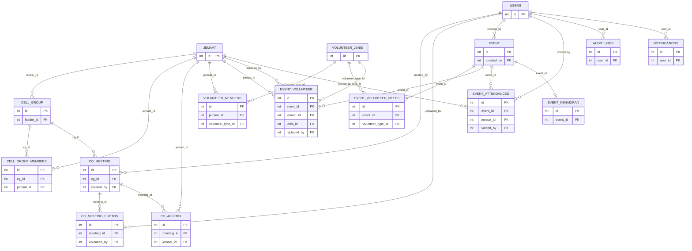

# LRS — GODS DNA CMS

LRS (Logical Record Structure) diturunkan dari ERD (lihat `erd.md`).
Setiap tabel ditampilkan hanya dengan PK dan FK-nya — atribut non-key
tetap mengikuti definisi di ERD/BAGIAN 0 dokumen spesifikasi, namun
tidak diulang di sini agar fokus pada struktur relasi.

Catatan (migration 005): atribut non-key `jemaat.nama`, `jemaat.tgl_lahir`,
dan `jemaat.jenis_kelamin` kini bertipe TEXT berisi ciphertext AES-256-CBC,
masing-masing dengan kolom IV pendamping `nama_iv`, `tgl_lahir_iv`,
`jenis_kelamin_iv` (VARCHAR(32) NULL) — pola sama dengan `no_hp_iv`.
Lihat spesifikasi lengkap di `erd.md` dan `src/database/schema.sql`.

Notasi kardinalitas: `1 : N` dibaca "1 baris di tabel referensi
berelasi dengan N baris di tabel pemilik FK". `1 : 1` berarti relasi
satu-ke-satu (FK bersifat unique).

## Daftar Relasi Foreign Key (24 relasi)

| No | Kolom FK | Referensi | Kardinalitas | Nullable | Keterangan |
|----|----------|-----------|--------------|----------|------------|
| 1 | `cell_group.leader_id` | `jemaat.id` | 1 : N | Ya | Satu jemaat bisa jadi leader CG; NULL jika CG belum punya leader (ON DELETE SET NULL) |
| 2 | `cell_group_members.cg_id` | `cell_group.id` | 1 : N | Tidak | Satu CG punya banyak anggota |
| 3 | `cell_group_members.jemaat_id` | `jemaat.id` | 1 : N | Tidak | Satu jemaat bisa anggota banyak CG (multi-CG, BAGIAN 3.2) |
| 4 | `cg_meeting.cg_id` | `cell_group.id` | 1 : N | Tidak | Satu CG punya banyak meeting |
| 5 | `cg_meeting.created_by` | `users.id` | 1 : N | Tidak | Satu user membuat banyak meeting |
| 6 | `cg_meeting_photos.meeting_id` | `cg_meeting.id` | 1 : N | Tidak | Satu meeting punya maks 10 foto (BAGIAN 3.3) |
| 7 | `cg_meeting_photos.uploaded_by` | `users.id` | 1 : N | Tidak | Satu user upload banyak foto |
| 8 | `cg_absensi.meeting_id` | `cg_meeting.id` | 1 : N | Tidak | Satu meeting punya banyak baris absensi |
| 9 | `cg_absensi.jemaat_id` | `jemaat.id` | 1 : N | Tidak | Satu jemaat punya banyak riwayat absensi |
| 10 | `volunteer_members.jemaat_id` | `jemaat.id` | 1 : N | Tidak | Satu jemaat daftar ke banyak jenis volunteer |
| 11 | `volunteer_members.volunteer_type_id` | `volunteer_jenis.id` | 1 : N | Tidak | Satu jenis volunteer punya banyak anggota |
| 12 | `event.created_by` | `users.id` | 1 : N | Tidak | Satu user membuat banyak event |
| 13 | `event_volunteer_needs.event_id` | `event.id` | 1 : N | Tidak | Satu event punya banyak baris kebutuhan volunteer |
| 14 | `event_volunteer_needs.volunteer_type_id` | `volunteer_jenis.id` | 1 : N | Tidak | Satu jenis volunteer dibutuhkan di banyak event |
| 15 | `event_volunteer.event_id` | `event.id` | 1 : N | Tidak | Satu event punya banyak assignment |
| 16 | `event_volunteer.jemaat_id` | `jemaat.id` | 1 : N | Tidak | Satu jemaat punya banyak assignment (lintas event) |
| 17 | `event_volunteer.jenis_id` | `volunteer_jenis.id` | 1 : N | Tidak | Satu jenis volunteer dipakai di banyak assignment |
| 18 | `event_volunteer.replaced_by` | `jemaat.id` | 1 : N | Ya | Jemaat pengganti (BAGIAN 5.6 CASE A/B); NULL jika belum ada penggantian |
| 19 | `event_attendances.event_id` | `event.id` | 1 : N | Tidak | Satu event punya banyak baris kehadiran volunteer |
| 20 | `event_attendances.jemaat_id` | `jemaat.id` | 1 : N | Tidak | Satu jemaat punya banyak riwayat bertugas |
| 21 | `event_attendances.voided_by` | `users.id` | 1 : N | Ya | NULL jika belum di-void (rule #11, BAGIAN 12) |
| 22 | `event_kehadiran.event_id` | `event.id` | 1 : 1 | Tidak | UPSERT per event_id (BAGIAN 5.8) → unique constraint |
| 23 | `audit_logs.user_id` | `users.id` | 1 : N | Ya | NULL jika user sudah dihapus (ON DELETE SET NULL) |
| 24 | `notifications.user_id` | `users.id` | 1 : N | Tidak | Notifikasi dikirim ke user LEADER tertentu |

## Tabel Tanpa FK

- `users`
- `jemaat`
- `volunteer_jenis`